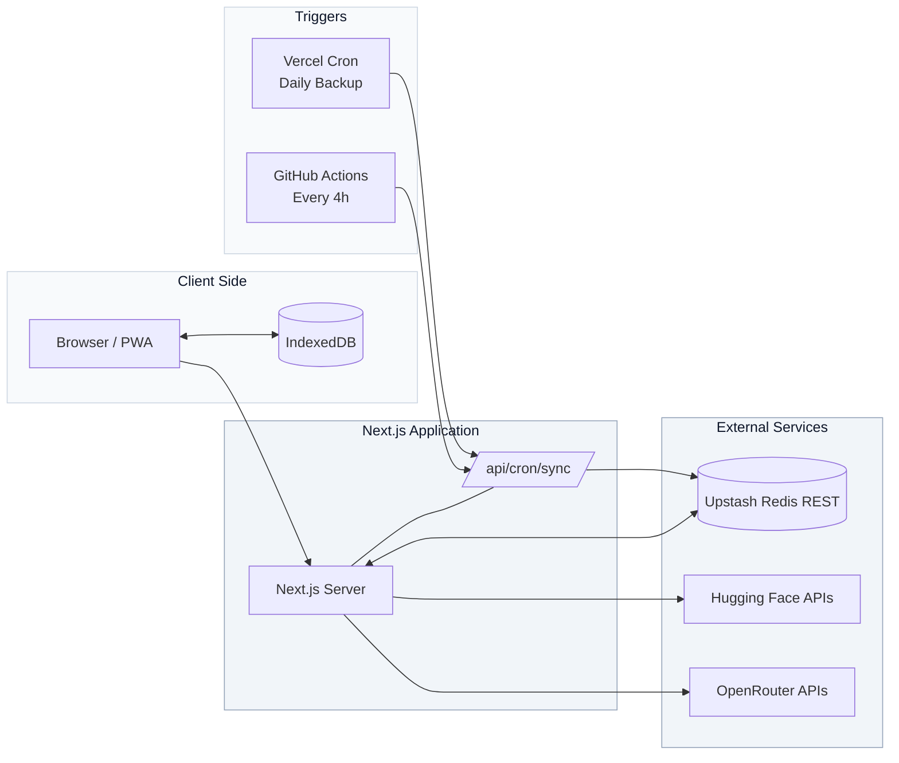

<p align="center">
  <a href="https://vulpix.vercel.app" aria-label="Open Vulpix">
    
  </a>
</p>

<h1 align="center">Vulpix</h1>

<p align="center">
  <strong>The intelligent gateway to AI metadata.</strong><br />
  Search the live frontier, inspect model/dataset metadata, chat via BYOK playground, compare models in Arena — one PWA.
</p>

<p align="center">
  
  
  
  
  
  
</p>

> [!IMPORTANT]
> **Proprietary — Vulpix Labs.** No cloning, forking, or redistribution. 30-day evaluation only by written permission. See `LICENSE.md`.

## About

Vulpix aggregates live metadata from Hugging Face + OpenRouter. No relational DB — upstream is source of truth, Upstash Redis (REST) is cache/lock/budget, IndexedDB is client playground.

## Stack

| Layer | Tech |
|---|---|
| Framework | Next.js 16.3.2 App Router, Turbopack, React 19.2.8 |
| Language | TypeScript strict |
| Styling | Tailwind CSS v4, Radix UI, shadcn |
| PWA | Serwist 386 precache, `pages-v2` 5m, `apis-v2` 120s |

## Quick Start

```bash
git clone https://github.com/vulpixlabs/vulpix.git
cd vulpix
npm ci
cp .env.example .env.local
# fill .env.local then
npm run dev
# http://localhost:3000
curl -H "Authorization: Bearer $CRON_SECRET" "http://localhost:3000/api/cron/sync?force=all"
```

## Environment

| Variable | Scope | Notes |
|---|:---:|---|
| `UPSTASH_REDIS_REST_URL` | Server | `https://...upstash.io` |
| `UPSTASH_REDIS_REST_TOKEN` | Server | REST token |
| `CRON_SECRET` | Server | 32+ chars, timingSafeEqual |
| `HF_TOKEN` | Server | HF read token |
| `OPENROUTER_API_KEY` | Server | OpenRouter |
| `NEXT_PUBLIC_SITE_URL` | Public | `https://vulpix.vercel.app` |

Only `NEXT_PUBLIC_` is exposed to client. Never commit `.env.local`.

## Commands

| Command | Use |
|---|---|
| `npm run dev` | Turbopack dev |
| `npm run lint` | ESLint |
| `npx tsc --noEmit` | Typecheck |
| `npm run build` | Production + SW |
| `npm run test:e2e` | Playwright Chromium/WebKit |

Gate: `lint && tsc && build && test:e2e`.

## Architecture



Model, benchmark, activity, and combined caches use a four-hour TTL. Provider metadata retains its route-specific TTL.

## API

| Endpoint | Notes |
|---|---|
| `GET /api/models` | combined `source: redis-combined/recombined/live-fallback` `s-maxage=300` |
| `GET /api/hf/models /datasets` | HF proxy |
| `GET /api/arena/benchmarks /activity /providers` | live, `x-or-key` optional |
| `GET /api/brand/[brand]?color=` | SimpleIcons→SVGL→favicon |
| `GET /api/cron/sync` | `Bearer CRON_SECRET` |

## Structure

```
Vulpix/
|-- public/
|   |-- brands/ (18 svg)
|   |-- icons/ (4 png)
|   |-- screenshots/ (2 png)
|   |-- apple-touch-icon.png
|   `-- vulpix-logo.png
|-- src/
|   |-- app/
|   |   |-- api/ (cron, hf, models, arena, brand, playground)
|   |   |-- arena/page.tsx
|   |   |-- hub/
|   |   |-- playground/
|   |   |-- manifest.ts
|   |   `-- sw.ts
|   |-- components/ (arena, hub, sections, ui)
|   `-- lib/ (redis, rate-limit, sync, brand-logos)
|-- tests/e2e/ (cron, models, pwa)
|-- playwright.config.ts
`-- vercel.json
```

## Deployment (manual)

**GitHub:** `vulpixlabs/vulpix` private (30-day eval). Teams `core` Admin, `dev` Write, `qa` Triage. Branch `main` protected: Require PR + QA status.

**Vercel:** Import `vulpixlabs/vulpix` → Env `UPSTASH_REDIS_REST_URL/TOKEN, CRON_SECRET, HF_TOKEN, OPENROUTER_API_KEY, NEXT_PUBLIC_SITE_URL` Sensitive → Redeploy. Hobby backup cron runs daily at `0 2 * * *`.

**GitHub Actions:** Add the same `CRON_SECRET` as a repository or organization secret. `.github/workflows/sync.yml` calls the production sync endpoint every four hours (`0 */4 * * *`, UTC).

## QA

```bash
npm run test:e2e
npx playwright test --ui
npx playwright show-report
```
CI `.github/workflows/qa.yml` runs lint, tsc, build, 44 tests (chromium/webkit + mobile).

---

<p align="center">Vulpix Labs · Proprietary · 30-day eval</p>
