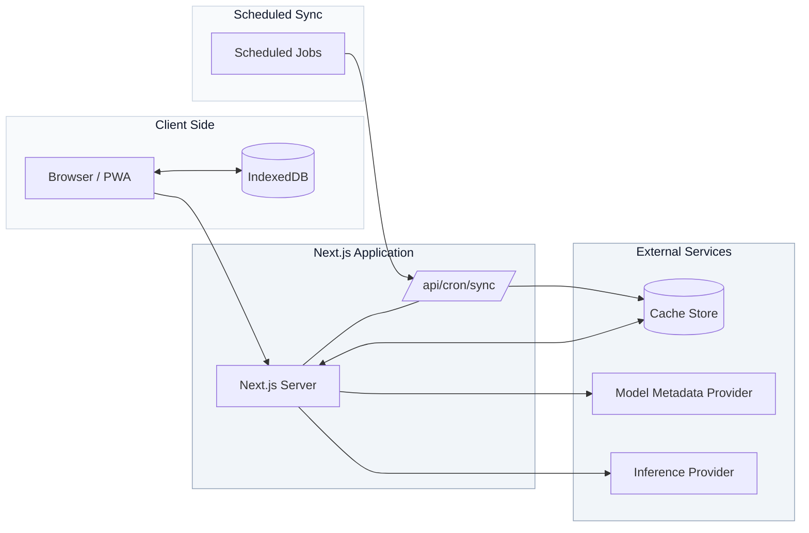

<p align="center">
  <a href="https://vulpix.vercel.app" aria-label="Open Vulpix">
    
  </a>
</p>

<h1 align="center">Vulpix</h1>

<p align="center">
  <strong>The intelligent gateway to AI metadata.</strong><br />
  Search the live frontier, inspect model/dataset metadata, chat via a BYOK playground, compare models in the Arena — one PWA.
</p>

<p align="center">
  
  
  
  
  
  
</p>

> [!IMPORTANT]
> **Proprietary — Vulpix Labs.** No cloning, forking, or redistribution. Evaluation access only by written permission — open an issue to request access.

## About

Vulpix aggregates live metadata from external model and dataset providers into a single hub. There's no relational database — upstream providers are the source of truth, Redis (REST) handles cache/lock/budget duties, and IndexedDB powers the client-side playground.

## Stack

| Layer | Tech |
|---|---|
| Framework | Next.js 16.3.2 App Router, Turbopack, React 19.2.8 |
| Language | TypeScript strict |
| Styling | Tailwind CSS v4, Radix UI, shadcn |
| PWA | Serwist 386 precache, `pages-v2` 5m, `apis-v2` 120s |

## Quick Start

```bash
git clone https://github.com/vulpixlabs/vulpix.git
cd vulpix
npm ci
cp .env.example .env.local
# fill .env.local then
npm run dev
# http://localhost:3000
curl -H "Authorization: Bearer $CRON_SECRET" "http://localhost:3000/api/cron/sync?force=all"
```

## Environment

| Variable | Scope | Notes |
|---|---|---|
| `KV_STORE_URL` | Server | REST-based cache store endpoint |
| `KV_STORE_TOKEN` | Server | REST token for the cache store |
| `CRON_SECRET` | Server | 32+ chars, timing-safe comparison |
| `MODEL_PROVIDER_TOKEN` | Server | Read token for the primary model metadata provider |
| `INFERENCE_PROVIDER_KEY` | Server | Key for the multi-model inference provider |
| `NEXT_PUBLIC_SITE_URL` | Public | `https://vulpix.vercel.app` |

Only `NEXT_PUBLIC_` variables are exposed to the client. Never commit `.env.local`.

## Commands

| Command | Use |
|---|---|
| `npm run dev` | Turbopack dev |
| `npm run lint` | ESLint |
| `npx tsc --noEmit` | Typecheck |
| `npm run build` | Production + service worker |
| `npm run test:e2e` | Playwright, Chromium/WebKit |

Gate: `lint && tsc && build && test:e2e`.

## Architecture



Model, benchmark, activity, and combined caches use a four-hour TTL. Provider metadata retains its own route-specific TTL.

## API

| Endpoint | Notes |
|---|---|
| `GET /api/models` | Combined view, `source: cache-combined/recombined/live-fallback`, `s-maxage=300` |
| `GET /api/hub/models` `/datasets` | Model & dataset metadata proxy |
| `GET /api/arena/benchmarks` `/activity` `/providers` | Live benchmark data, optional client-supplied inference key |
| `GET /api/brand/[brand]` | Brand icon resolution with fallback chain |
| `GET /api/cron/sync` | Sync trigger, requires `Bearer CRON_SECRET` |

## Project Structure

```
Vulpix/
|-- public/
|   |-- brands/
|   |-- icons/
|   |-- screenshots/
|   `-- vulpix-logo.png
|-- src/
|   |-- app/
|   |   |-- api/ (cron, hub, models, arena, brand, playground)
|   |   |-- arena/page.tsx
|   |   |-- hub/
|   |   |-- playground/
|   |   |-- manifest.ts
|   |   `-- sw.ts
|   |-- components/ (arena, hub, sections, ui)
|   `-- lib/ (cache, rate-limit, sync, brand-logos)
|-- tests/e2e/ (cron, models, pwa)
|-- playwright.config.ts
`-- vercel.json
```

## QA

```bash
npm run test:e2e
npx playwright test --ui
npx playwright show-report
```

CI runs lint, typecheck, build, and 44 end-to-end tests across Chromium, WebKit, and mobile viewports on every change to `main`.

---

<p align="center">Vulpix Labs · Proprietary · Part of the Mavent ecosystem</p>
